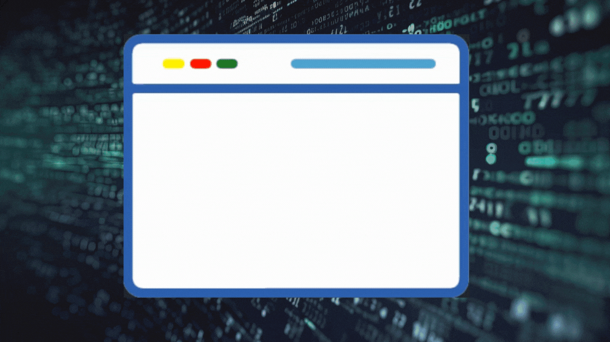

# Fix_My_Code_Challenge

Fixing code can be a challenging task that requires careful analysis and problem-solving skills. Here are some common challenges that developers may face when fixing code:

<ul>
<li>Understanding the Problem: Before fixing code, it is crucial to fully understand the problem at hand. This involves reading through the code, identifying the inputs and outputs, and understanding the expected behavior. It is important to consider edge cases and potential errors that may arise.</li>
<li>Debugging and Troubleshooting: When code doesn't work as expected, developers need to identify and fix the bugs causing the issue. This often involves reading error messages, analyzing the code, and using debugging tools to trace the flow of execution. It is important to pay attention to error messages and search for solutions online if needed.</li>
<li>Familiarity with the Codebase: Fixing code requires a good understanding of the codebase. If the code was written by someone else, it may be challenging to navigate and comprehend the logic. In such cases, developers may need to spend time studying the code, looking up unfamiliar concepts, and consulting documentation or external resources.</li>
<li>Identifying and Addressing Code Smells: Code smells refer to parts of the code that are not technically incorrect but can lead to issues and make the codebase harder to maintain. Fixing code smells involves refactoring the code to improve its structure, readability, and maintainability. This can be a time-consuming process that requires careful analysis and planning.</li>
<li>Ensuring Compliance with Requirements: When fixing code, it is important to ensure that the solution meets all the requirements specified in the problem description. This includes checking for correct outputs, handling edge cases, and adhering to coding standards and best practices.</li>
<li>Testing and Validation: After fixing the code, it is crucial to thoroughly test the solution to ensure that it behaves correctly under various conditions. This involves writing test cases, running them, and validating the results. Testing helps identify any remaining issues and ensures that the fixed code works as intended.</li>
<li>Collaboration and Communication: In some cases, fixing code may require collaboration with other team members or stakeholders. This can involve discussing the problem, sharing insights, and seeking feedback. Effective communication and collaboration skills are essential for resolving code issues efficiently.</li>
</ul>